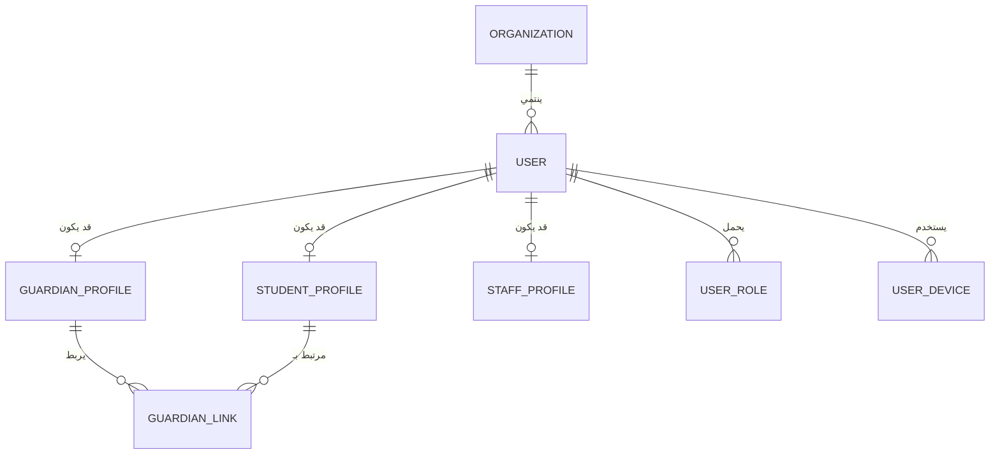
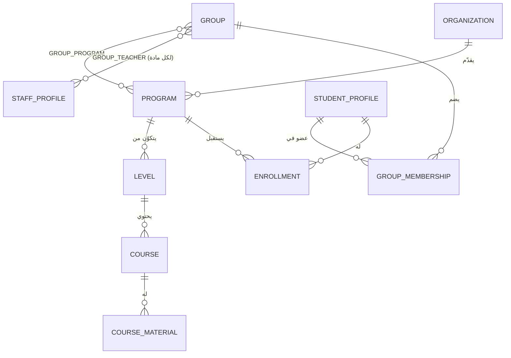
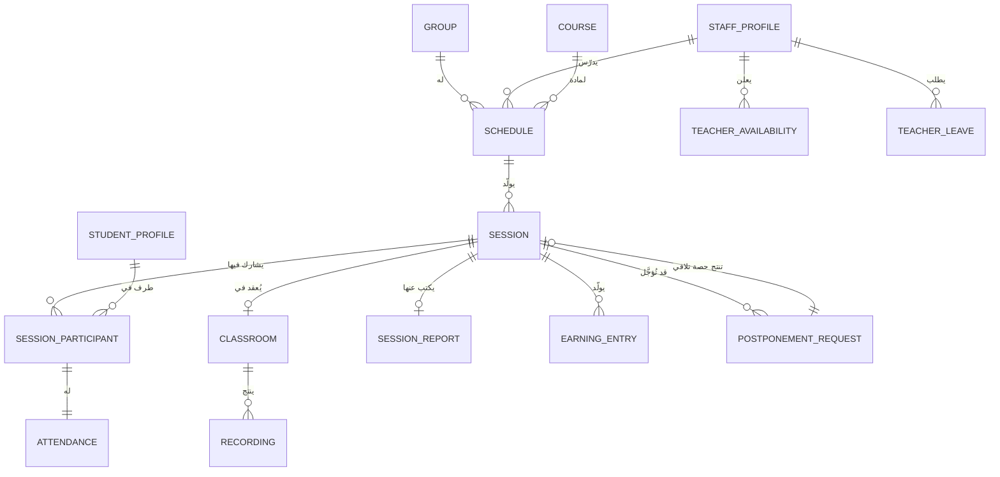
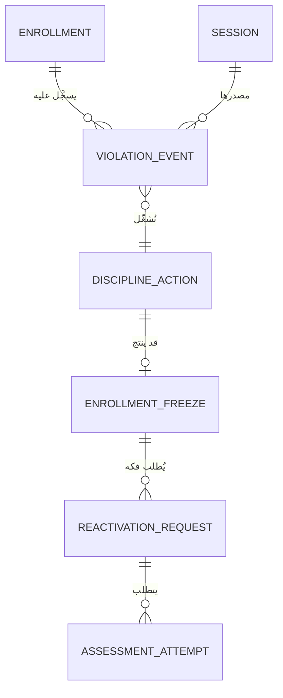
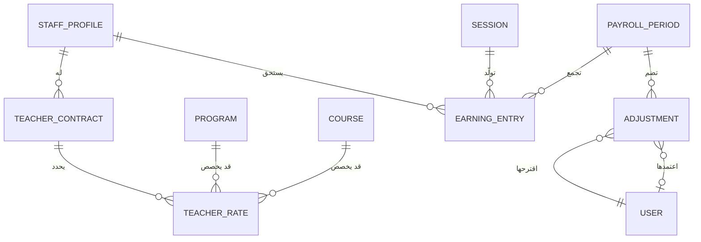
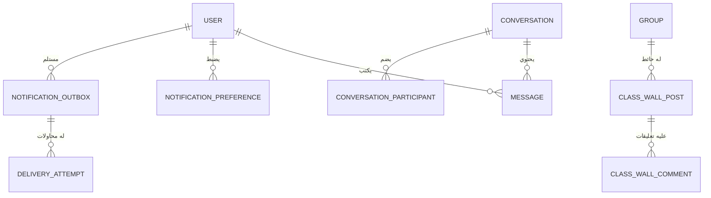

# 04 — نموذج العلاقات

يصف هذا الملف **العلاقات وكثافتها** والقرارات التي تقف خلفها.
الجداول والأعمدة والفهارس في [`07-database-schema.md`](07-database-schema.md).

---

## 1. الهوية والأشخاص



### قرارات مفسِّرة

**لماذا `User` منفصل عن `StudentProfile`؟**
لأن الشخص الواحد قد يكون معلمًا وولي أمر في الوقت نفسه. المؤسسة صغيرة
والاحتمال حقيقي. دمجهما يعني حسابين لشخص واحد أو اختراقًا للنموذج لاحقًا.

**لماذا `GuardianLink` جدول مستقل وليس `guardian_id` في ملف الطالب؟**
- ولي أمر واحد لعدة أبناء.
- طالب واحد قد يكون له وليّا أمر (أب وأم) بصلاحيات مختلفة.
- العلاقة نفسها تحمل بيانات: صلة القرابة، جهة التواصل الأساسية،
  وهل ينوب عن الطالب في القرارات.

**علاقة `can_act_for`:** تُضبط `true` تلقائيًا لمن هم دون 13 سنة،
وتُضبط يدويًا فوق ذلك. لا تُشتق من العمر عند كل طلب — تُخزَّن وتُراجع.

---

## 2. البنية الأكاديمية



### قرارات مفسِّرة

**لماذا `GROUP ↔ PROGRAM` كثير لكثير؟**
إجابة العميل الصريحة: *"من الممكن أن يكون في برامج مشتركة بين أكثر من صف."*
حقل `program_id` مفرد في المجموعة سيُكسر عند أول حالة، والهجرة وقتها مؤلمة.

**لماذا `GROUP ↔ TEACHER` كثير لكثير مع تحديد المادة؟**
إجابة العميل: *"من الممكن أن يكون هناك أكثر من معلم لأكثر من مادة داخل الصف."*
الجدول الوسيط يحمل `course_id` — أي: هذا المعلم يدرّس هذه المادة لهذه المجموعة.

**لماذا القيد على البرنامج وليس المجموعة؟**
لأن الطالب يُقيَّد في **مسار تعليمي**، والمجموعة وسيلة تنظيمية قد تتغير.
نقل الطالب بين مجموعتين لا يجب أن يمس قيده ولا سجل انضباطه.

---

## 3. الجدولة والحصص



### قرارات مفسِّرة

**لماذا `Schedule` منفصل عن `Session`؟**
`Schedule` قاعدة تكرار (RRULE) قد تمتد ستة أشهر. `Session` حدث واحد بوقت
محدد وحالة وتاريخ. تغيير قاعدة التكرار **لا يجوز** أن يعدّل حصصًا انعقدت
بالفعل أو حُسبت مستحقاتها.

**التوليد المسبق (Materialization):** تُولَّد الحصص الفعلية من القاعدة قبل
موعدها بـ 60 يومًا (`scheduling.recurrence.materialize_ahead_days`).
الحصة المولَّدة كيان مستقل من لحظة إنشائها.

**علاقة حصة التلافي بأصلها:**
```
Session (الأصلية, status=Postponed)
   └── PostponementRequest
          └── Session (التلافي, makeup_for_session_id → الأصلية)
```
العلاقة صريحة ومحفوظة لأن عليها يترتب تحرير مستحق المعلم المؤجَّل.

**`SESSION_PARTICIPANT` ولماذا لا نربط الطالب بالحصة مباشرة؟**
لأن المشاركة تحمل بياناتها: وقت الدخول والخروج، والدقائق الفعلية،
ورابط الدخول الشخصي، وحالة الحضور. وهي أيضًا ما يُخصم منه رصيد الطالب لاحقًا.

---

## 4. الانضباط



**لماذا `VIOLATION_EVENT` كيان وليس عدّادًا؟**
لأن العدّاد لا يجيب: *أي غياب بالضبط تسبب في التجميد؟*
كل مخالفة سجل مستقل بمصدره وتاريخه ونافذته. العدّاد **مشتق** من هذه السجلات
داخل النافذة الشهرية، ولا يُخزَّن كرقم قابل للتلاعب.

**تصفير العدّاد شهريًا** لا يحذف السجلات — يغيّر نطاق الاحتساب فقط.
السجل التاريخي كامل ودائم.

---

## 5. المستحقات



### قرارات مفسِّرة

**`TEACHER_RATE` بأربعة مستويات تخصيص:**
```
سعر لهذه المادة تحديدًا      ← الأدق
سعر لهذا البرنامج
سعر حسب نوع الحصة (فردي/جماعي)
السعر الافتراضي في العقد     ← الأعم
```
هذا ليس تعقيدًا زائدًا — العميل قال صراحةً إن الأسعار تختلف حسب البرنامج
وحسب نوع الحصة وحسب كفاءة المعلم.

**لماذا `EARNING_ENTRY` مرتبطة بالحصة وبالفترة معًا؟**
- بالحصة: لتتبع "من أين جاء هذا المبلغ".
- بالفترة: لأن الإقفال يتم على مستوى الفترة، وحصة التلافي قد تقع
  في فترة تالية للحصة الأصلية.

**`ADJUSTMENT` بمقترح ومعتمد منفصلين:** قيد قاعدة البيانات نفسه يمنع
`proposed_by = approved_by`. القاعدة لا تُترك للتطبيق وحده.

---

## 6. الإشعارات والمراسلات



**لماذا Outbox وليس إرسالًا مباشرًا؟**
لأن قناة قد تسقط. الإشعار يُكتب أولًا في `notification_outbox` داخل نفس
معاملة الحدث، ثم تلتقطه المهام الخلفية للإرسال. سقوط واتساب لا يعني
ضياع إشعار تجميد قيد.

**المراسلات تحت الإشراف:** كل `Conversation` لها `is_moderated` و
`visible_to_permissions`. الإدارة ترى المحادثات بين الطلاب والمعلمين
بحكم صلاحيتها، وهذا معلن للمستخدمين في شروط الاستخدام لا مخفي.

---

## 7. الجذر المشترك: `organization_id`

**كل جدول يحمل بيانات تشغيلية يحمل `organization_id`** — من اليوم الأول،
حتى مع مؤسسة واحدة.

| السبب | الأثر |
|-------|-------|
| الاستعداد لمؤسسة ثانية | لا هجرة بيانات مؤلمة لاحقًا |
| عزل الاستعلامات | Global Scope واحد يمنع تسرّب البيانات |
| فهارس مركّبة | `(organization_id, ...)` أسرع من البداية |

**لكن:** لا ننفّذ تعدد المؤسسات الكامل الآن — لا اختيار مؤسسة عند الدخول،
ولا نطاقات فرعية، ولا فوترة لكل مؤسسة. المفتاح `features.multi_organization`
مطفأ، والعمود موجود.

---

## 8. قرارات المفاتيح والحذف

| القرار | الاختيار | السبب |
|--------|----------|-------|
| المفتاح الأساسي | ULID نصي | لا يكشف الأحجام · قابل للفرز زمنيًا · يُولَّد قبل الحفظ |
| الحذف | `SoftDeletes` على كل جدول بشري | لا حذف نهائي لبيانات إنسان |
| الحذف المالي | **ممنوع تمامًا** | القيود دفتر أستاذ — التصحيح بقيدة جديدة |
| التوقيتات | `timestamptz` بـ UTC | العرض بتوقيت المستخدم في طبقة العرض فقط |
| المبالغ | `bigint` بالوحدة الصغرى | لا `float` في أي حساب مالي |
| النصوص متعددة اللغات | `jsonb` بمفتاح اللغة | `{"ar": "...", "en": "..."}` |
