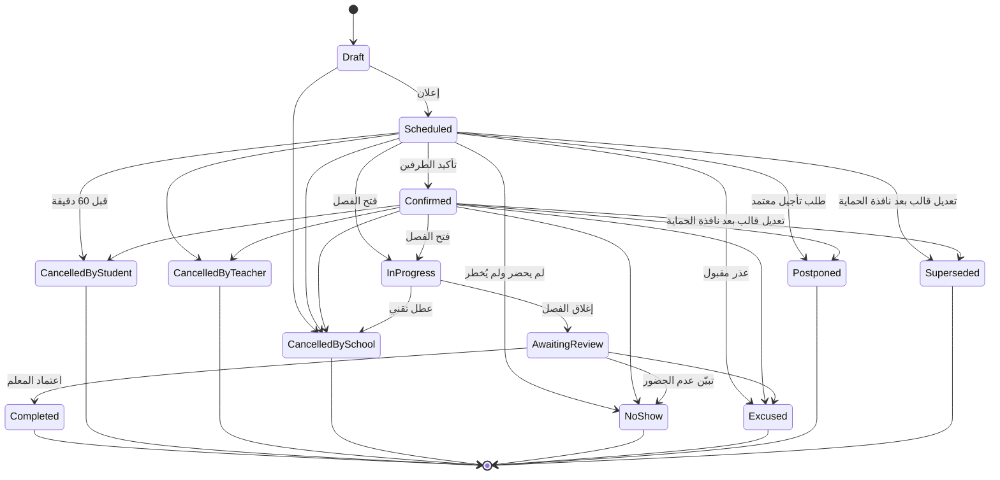
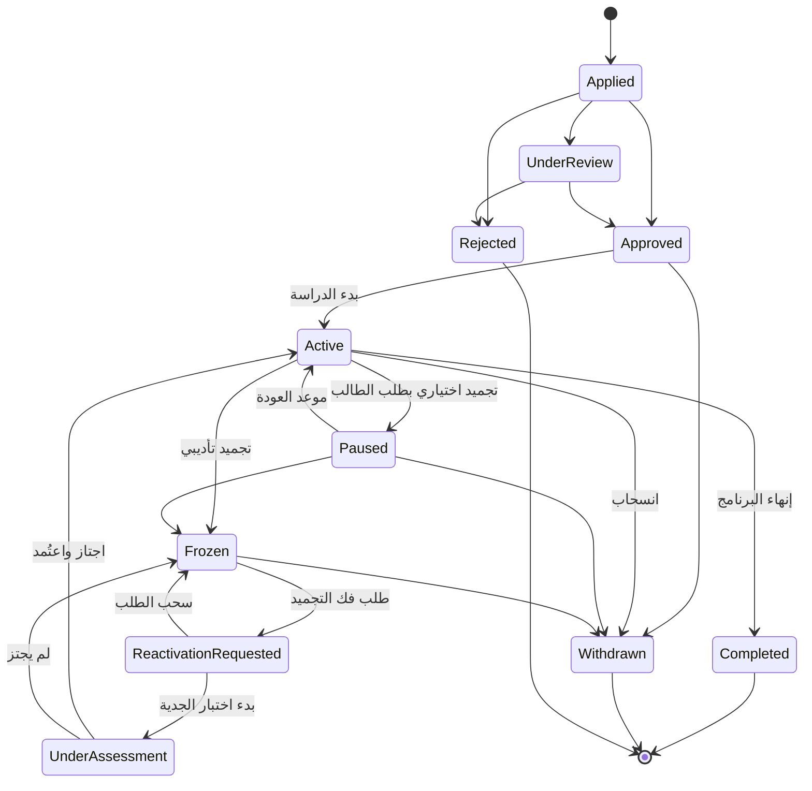
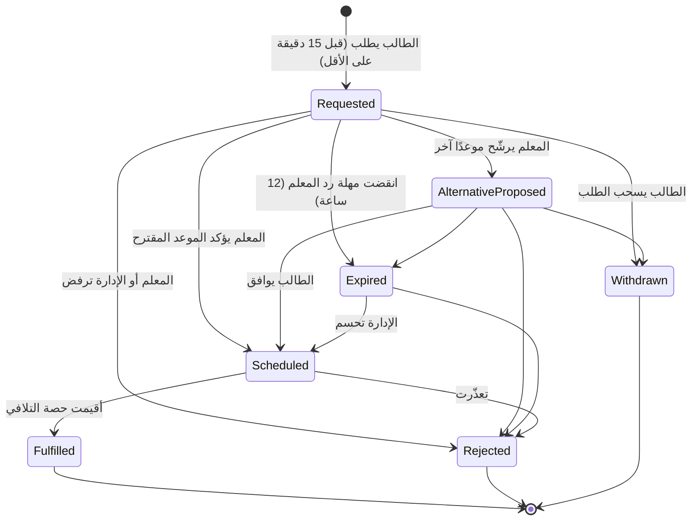
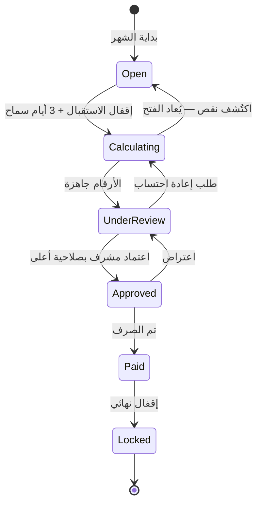
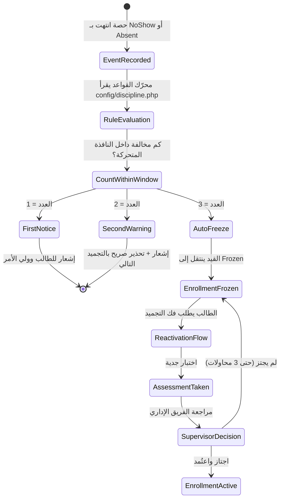

# 05 — آلات الحالات

خمس آلات حالات تحكم المنصة. **لو نُفِّذت هذه بدقة، يختفي نصف الأخطاء
المستقبلية قبل أن يُكتب سطر واحد من الواجهات.**

## القواعد العامة

1. الحالة **enum** في `src/Domain/Enums/` — لا نص ولا رقم.
2. كل انتقال يمر بـ `canTransitionTo()`. الانتقال غير المذكور **مرفوض**.
3. كل انتقال يُسجَّل في `*_status_history` بـ: من، ومتى، ومن أي حالة، والسبب.
4. الحالات النهائية لا يُخرج منها إلا بمسار تصحيح موثّق ومعتمد.
5. الانتقال ينشر Domain Event — والموديولات الأخرى تستمع، ولا تُستدعى مباشرة.

---

## 1. الحصة — `SessionStatus`



### ما يترتب على كل حالة نهائية

> أعمدة المال في الجدول التالي تحفظ قواعد المنتج للمستقبل، لكنها ليست تنفيذًا ولا
> بوابة قبول في المرحلة الأولى الحالية؛ Payroll/Billing مؤجلان.

| الحالة | قيدة المعلم | مخالفة على الطالب | رصيد الطالب | حصة تلافي |
|--------|-------------|-------------------|-------------|-----------|
| `Completed` | أجر كامل | لا | تُخصم | لا |
| `NoShow` | **أجر كامل** | **نعم** | تُخصم | لا |
| `Excused` | أجر كامل | لا | لا تُخصم | لا |
| `CancelledByStudent` | **خصم حصة** | لا | لا تُخصم | **لا** |
| `CancelledByTeacher` | **خصم حصة** | لا | **استرداد** | لا |
| `CancelledBySchool` | لا شيء | لا | لا تُخصم | لا |
| `Postponed` | **مؤجَّل** | لا | لا تُخصم | **نعم** |
| `Superseded` | لا قيدة — حدث مستقبلي استُبدل | لا | لا تتغير | لا |

### الانتقالات الآلية

| المُشغِّل | من | إلى |
|----------|-----|------|
| فتح المعلم للفصل | `Scheduled` / `Confirmed` | `InProgress` |
| مرور 30 دقيقة على نهاية الوقت | `InProgress` | `AwaitingReview` |
| مرور 30 دقيقة والفصل لم يُفتح أصلًا | `Scheduled` / `Confirmed` | `NoShow` |
| اعتماد المعلم لكشف الحضور | `AwaitingReview` | `Completed` |
| مرور مهلة اعتماد المعلم (24 ساعة) | `AwaitingReview` | تصعيد للمشرف (لا انتقال) |

### الحارس الحرج

> الانتقال إلى `Completed` **ممنوع** ما لم يكن لكل مشارك في الحصة
> سجل حضور معتمد. هذا حارس على مستوى الكيان، لا تحقق في الواجهة.

---

## 2. القيد — `EnrollmentStatus`



### الفرق بين `Paused` و `Frozen`

| | `Paused` | `Frozen` |
|---|----------|----------|
| من بدأه | **الطالب** بطلبه | **النظام** آليًا أو الإدارة |
| السبب | ظرف شخصي | بلوغ حد المخالفات داخل النافذة المتحركة |
| موعد العودة | **إلزامي ومحدد** | لا يوجد |
| العودة | آلية في موعدها | **باختبار وتقييم فقط** |
| سجل الانضباط | لا يتأثر | يُسجَّل |
| المدة | 7 إلى 90 يومًا | مفتوحة |

### الحارس الحرج

> `Frozen` → `Active` **مستحيل مباشرةً**. لا زر في أي لوحة تحكم يفعلها،
> ولا صلاحية تسمح بها. المسار الوحيد يمر بـ `ReactivationRequested`
> ثم `UnderAssessment` ثم اعتماد من صاحب صلاحية `enrollment.reactivate`.

### ما لا يحدث أبدًا

- الحساب لا يُحذف في أي حالة من الحالات أعلاه.
- بيانات الطالب وسجله وتقاريره تبقى مرئية له وللإدارة في كل الحالات.
- `Frozen` يمنع: دخول الحصص، رؤية محتوى الكورسات، الجدولة الجديدة.
- `Frozen` **لا يمنع**: الدخول للحساب، رؤية السجل، مراسلة الإدارة.

---

## 3. طلب التأجيل — `PostponementStatus`



### الأثر المالي على كل حالة

| الحالة | الحصة الأصلية | مستحق المعلم |
|--------|----------------|---------------|
| `Requested` | كما هي | لم يتحدد بعد |
| `Scheduled` | تصبح `Postponed` | **مؤجَّل** — قيدة بحالة `deferred` |
| `Fulfilled` | تبقى `Postponed` | **يُحرَّر** عند إقفال حصة التلافي |
| `Rejected` | تعود لحالتها | يخضع لنتيجة الحصة الأصلية |

### الحارس الحرج

> لا تُنشأ حصة التلافي إلا عند الانتقال إلى `Scheduled`، وتحمل
> `makeup_for_session_id`. حصة تلافي بلا أصل، أو أصل بحالة `Postponed`
> بلا حصة تلافي، حالة فاسدة تُكتشف في فحص السلامة اليومي.

---

## 4. فترة المستحقات — `PayrollPeriodStatus`



### ماذا يُقبل في كل حالة

| الحالة | قيود جديدة من الحصص | تسويات | تعديل الأرقام |
|--------|---------------------|--------|----------------|
| `Open` | نعم | نعم | — |
| `Calculating` | **لا** | نعم | نعم |
| `UnderReview` | لا | نعم | نعم |
| `Approved` | لا | **لا** | لا |
| `Paid` | لا | لا | **لا** |
| `Locked` | لا | لا | **لا** |

### أيام السماح الثلاثة

سببها حصص التلافي: حصة أُجّلت يوم 28 وأُقيمت يوم 2 من الشهر التالي.
مستحقها المؤجَّل يجب أن يُحرَّر في **فترة الحصة الأصلية** لا التالية،
وإلا اختلف كشف المعلم عما يتوقعه.

### الحارس الحرج

> بعد `Paid` لا يوجد مسار في التطبيق يعدّل رقمًا واحدًا في الفترة.
> التصحيح **دائمًا** بقيدة تسوية في الفترة المفتوحة، تحمل مرجع
> الفترة المقفلة وسبب التصحيح.

---

## 5. الانضباط — من مخالفة إلى تجميد



### النافذة المتحركة

```
العدّاد = عدد مخالفات هذا القيد خلال آخر discipline.counter_window_days
من لحظة الاحتساب
```

القيمة الحالية 30 يومًا من `config/discipline.php` مع `counter_window = rolling`.
لا يوجد تصفير أول الشهر؛ تسقط المخالفة من العدّاد عند خروجها من النافذة فقط.
هذا لا يحذف السجل — التاريخ كامل ودائم ويظهر في ملف الطالب.

### ما لا يُحتسب مخالفة

| الحدث | يُحتسب؟ | السبب |
|-------|---------|-------|
| غياب بعذر مقبول | لا | العذر قُبل من الإدارة |
| تأجيل معتمد | لا | الطالب التزم بالإجراء |
| إلغاء ضمن المهلة | لا | الطالب التزم بالمهلة |
| غياب المعلم | لا | ليس ذنب الطالب |
| إلغاء من المؤسسة | لا | ظرف تشغيلي |
| عطل تقني موثّق | لا | خارج إرادة الطالب |

### الحارس الحرج

> العدّاد **يُحسب** من سجلات `violation_events` عند كل تقييم،
> ولا يُخزَّن كعمود قابل للتعديل. لا يوجد مسار يغيّر رقم العدّاد مباشرة.

---

## اختبارات إلزامية لكل آلة حالات

كل آلة حالة تحتاج هذه الاختبارات في `tests/Unit` قبل أن تُعتبر منجزة:

1. **مصفوفة الانتقالات كاملة** — كل انتقال مسموح ينجح، وكل غير مسموح يرمي استثناءً.
2. **الحالات النهائية مقفلة** — أي انتقال منها مرفوض.
3. **الحارس الحرج** — الاختبار المذكور صراحةً تحت كل آلة أعلاه.
4. **الحدث يُنشر** — كل انتقال ينشر الحدث الصحيح بالحمولة الصحيحة.
5. **السجل يُكتب** — كل انتقال يترك سطرًا في `*_status_history`.
