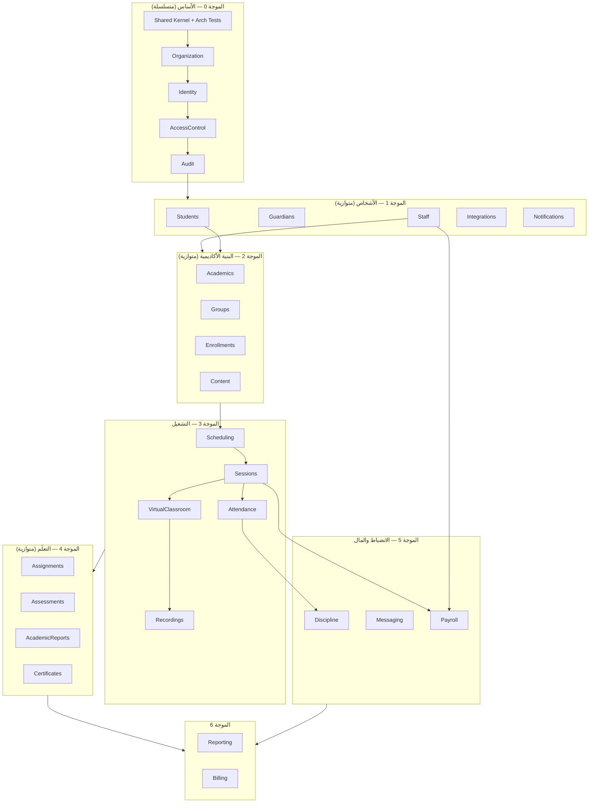

# 19 — خريطة اعتماد الوكلاء وترتيب البناء

> **مرجع معماري تاريخي لترتيب بناء الموديولات، وليس طابور التنفيذ الحالي.**
> طابور المرحلة الأولى V2: `docs/agent-tasks/QUEUE-antigravity.md`.

الغرض: أن يعمل أكبر عدد من الوكلاء بالتوازي **دون أن يعطّل أحدهم الآخر
أو يبني على أساس غير موجود**.

---

## قاعدة التوازي

> وكيلان يعملان بالتوازي بأمان إذا كانا في **نفس الموجة**،
> ولا يشتركان في ملكية أي جدول، ولا يعتمد أحدهما على عقد لم يُسلَّم بعد.

---

## المخطط



---

## الموجة 0 — الأساس

**متسلسلة تمامًا. لا توازي هنا.** كل ما بعدها يعتمد عليها.

| الترتيب | العمل | يُسلِّم |
|---------|-------|--------|
| 0.1 | Shared Kernel + اختبارات المعمارية | `BaseModuleServiceProvider` · `DomainEvent` · `Money` · `TimeRange` · اختبارات الحدود |
| 0.2 | Organization | `organizations` · التقويم · العطلات · قارئ الإعدادات |
| 0.3 | Identity | `users` · الدخول · التحقق · 2FA · `User::class` |
| 0.4 | AccessControl | الأدوار والصلاحيات · `Gate` · seeder المصفوفة |
| 0.5 | Audit | `audit_log` · المستمع العام · واجهة الاستعراض |

**بوابة الخروج:** مستخدم بدور يدخل، وكل فعل حسّاس يظهر في سجل التدقيق.

> **اختبارات المعمارية تُكتب في 0.1 قبل أي موديول.**
> بناؤها لاحقًا يعني اكتشاف عشرات الخروقات دفعةً واحدة.

---

## الموجة 1 — الأشخاص والبنية التحتية

**خمسة وكلاء بالتوازي.** لا تقاطع في ملكية الجداول.

| الوكيل | يملك | يُسلِّم عقدًا |
|--------|------|---------------|
| A1 Students | `student_profiles` | `StudentDirectory` |
| A2 Guardians | `guardian_profiles` · `guardian_links` | `GuardianDirectory` |
| A3 Staff | `staff_profiles` · العقود · الأسعار · الإتاحة | **`TeacherRateResolver`** · `TeacherAvailabilityChecker` |
| A4 Integrations | مزوّدو الخدمات + تنفيذات `Null` | `WhatsAppGateway` · `EmailGateway` · `PushGateway` · `ObjectStorage` |
| A5 Notifications | `notification_outbox` وما يتبعه | `NotificationDispatcher` |

**نقطة تزامن:** A2 يحتاج `StudentDirectory` من A1.
الحل: A1 يسلّم **الواجهة** في أول ساعة، والتنفيذ بعدها. A2 يبرمج على الواجهة.

**بوابة الخروج:** استيراد Excel للطلاب والمعلمين يعمل، وإشعار تجريبي يصل.

---

## الموجة 2 — البنية الأكاديمية

**أربعة وكلاء بالتوازي.**

| الوكيل | يملك | يعتمد على |
|--------|------|------------|
| B1 Academics | `programs` · `levels` · `courses` | Organization |
| B2 Groups | `groups` · الجداول الوسيطة | B1 (واجهة) · A1 · A3 |
| B3 Enrollments | `enrollments` · سجل الحالات | B1 · A1 |
| B4 Content | `course_materials` | B1 · A4 |

**بوابة الخروج:** المجموعات الحالية للمؤسسة مستوردة بأعضائها.

---

## الموجة 3 — التشغيل (أخطر موجة)

**توازي جزئي فقط.**

```
C1 Scheduling ──┐
                ├──> C2 Sessions ──┬──> C3 VirtualClassroom ──> C5 Recordings
                                   └──> C4 Attendance
```

| الوكيل | يملك | لا يبدأ قبل |
|--------|------|--------------|
| C1 Scheduling | `schedules` · `postponement_requests` | الموجة 2 |
| C2 Sessions | `sessions` · المشاركون · سجل الحالات | C1 يسلّم عقد التوليد |
| C3 VirtualClassroom | `classrooms` · `classroom_events` | C2 يسلّم `SessionScheduled` |
| C4 Attendance | `attendances` | C2 + C3 (للأحداث) |
| C5 Recordings | `recordings` · `recording_views` | C3 |

**C1 و C2 يمكن أن يبدآ معًا** بشرط الاتفاق على عقد التوليد في الساعة الأولى.
**C3 و C4 متوازيان** بعد اكتمال C2.

**بوابة الخروج:** حصة حقيقية تُجدول وتُعقد وتُسجَّل ويُرصد حضورها وتُقفل آليًا.

---

## الموجة 4 — التعلّم

**أربعة وكلاء بالتوازي.** كلهم يعتمدون على الموجة 3 ولا يعتمد أحدهم على الآخر.

| الوكيل | يملك | ملاحظة حرجة |
|--------|------|--------------|
| D1 Assignments | `assignments` · `submissions` | — |
| D2 Assessments | `assessments` · `questions` · `attempts` | **يجب أن يدعم نوع `reactivation`** — الانضباط يعتمد عليه |
| D3 AcademicReports | تقارير الحصة والشهرية | يستمع لـ `sessions.finalized` |
| D4 Certificates | القوالب · الشهادات · البادچات | الإصدار يدوي فقط في المرحلة الأولى |

---

## الموجة 5 — الانضباط والمال

| الوكيل | يملك | يعتمد على |
|--------|------|------------|
| E1 Discipline | `violation_events` · `discipline_actions` · `reactivation_requests` | C4 (الحضور) · B3 (القيد) · **D2 (اختبار فك التجميد)** |
| E2 Messaging | `conversations` · `messages` · حائط الصف | A5 · B2 |
| E3 Payroll | كل جداول المستحقات | C2 · **A3 (`TeacherRateResolver`)** |

**E3 هو أخطر وكيل في المشروع.** لا يبدأ قبل أن يقرأ
[`14-payroll-rules.md`](14-payroll-rules.md) كاملًا وينفّذ أمثلتها الثلاثة كاختبارات
**قبل** كتابة منطق الاحتساب.

---

## الموجة 6 — القراءة

| الوكيل | يملك | ملاحظة |
|--------|------|--------|
| F1 Reporting | `report_*` (Read Models) | لا يستورد نموذجًا من أحد |
| F2 Billing | جداول الفوترة | هجرات فقط · الموديول مطفأ |

---

## قواعد تسليم العقود

**المشكلة:** الوكيل B ينتظر عقدًا من الوكيل A فيتعطل.

**الحل — قاعدة الساعة الأولى:**

> أي وكيل يملك عقدًا يحتاجه غيره **يكتب الواجهة و DTOs في أول ساعة**
> ويدفعها، قبل أن يبدأ التنفيذ.

المستهلك يبرمج على الواجهة ويستخدم `Fake` في اختباراته حتى يصل التنفيذ.

### العقود الحرجة وموعدها

| العقد | المالك | مطلوب في |
|-------|--------|-----------|
| `TeacherRateResolver` | Staff | الموجة 5 (Payroll) |
| `StudentDirectory` | Students | الموجة 1 (Guardians) |
| `SessionQueryService` | Sessions | الموجة 4 و 5 |
| `NotificationDispatcher` | Notifications | كل الموجات |
| `VirtualClassroomProvider` | VirtualClassroom | الموجة 3 · **مُسلَّم بالفعل** |
| `AssessmentRunner` | Assessments | الموجة 5 (Discipline) |
| `ObjectStorage` | Integrations | الموجة 2 (Content) |

---

## بروتوكول التعارض

| الحالة | الإجراء |
|--------|---------|
| وكيلان يحتاجان تعديل نفس الجدول | **المالك فقط** يعدّل · الآخر يفتح طلبًا |
| وكيل يحتاج حقلًا في جدول غيره | يطلبه من المالك · لا يضيفه بنفسه |
| وكيل يحتاج حدثًا غير موجود | يضيفه في `09-domain-events.md` أولًا · ثم المالك ينشره |
| وكيلان يعدّلان نفس ملف الإعدادات | تعديل صغير منفصل لكل واحد · لا إعادة كتابة الملف |
| خلاف على حدود موديول | يُحسم في `08-module-boundaries.md` — لا اجتهاد |

---

## قائمة فحص قبل تشغيل وكيل

- [ ] موجته السابقة اجتازت بوابتها
- [ ] العقود التي يعتمد عليها مُسلَّمة (ولو كواجهات)
- [ ] حزمته في [`20-agent-task-packages.md`](20-agent-task-packages.md) مقروءة
- [ ] الجداول التي سيملكها لا يملكها وكيل آخر نشط
- [ ] يعرف [`21-definition-of-done.md`](21-definition-of-done.md)
